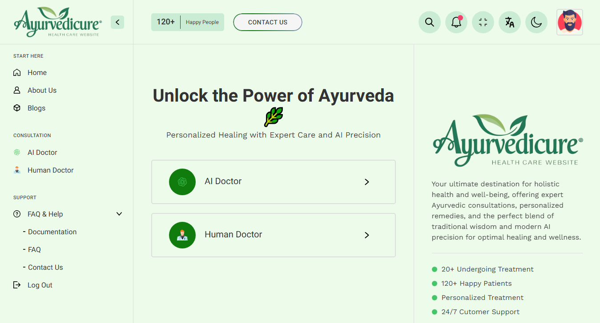

# PrakritiInsight 🌿

A friendly, open-source toolkit for simple Prakriti (Ayurvedic constitution) analysis and basic Ayurvedic guidance.



Hello — this README was written to help you get PrakritiInsight running quickly. I tried to keep instructions short and practical so you can clone, install, and launch the app on Windows without hunting for missing steps.

PrakritiInsight is a small web project containing a static frontend, a Node.js/Express backend with simple authentication and data storage, and an optional Python demo that shows how a lightweight ML model could be experimented with locally.

This repository contains both the frontend (static HTML/CSS/JS) and a Node.js backend (Express + Mongoose). A small Python `app.py` that demonstrates a TensorFlow-based classifier is also included — see the Notes below.

## Quick links

- Frontend: `frontend/`
- Backend (Node/Express): `server.js` (root) and `backend/server.js`
- API routes: `routes/` and `backend/routes/`
- Python demo model: `app.py` (root) and `backend/app.py`

## How to download

Open a Windows command prompt (cmd) and run:

```cmd
git clone https://github.com/Sapna190/PrakritiInsight.git
cd "PrakritiInsight"
```

## Run the full app (recommended)

Prerequisites:
- Node.js (v16+ or v18+ recommended)
- npm
- A running MongoDB instance (local or hosted) if you want to use the API features that persist data.

Steps (from repository root):

```cmd
REM Install dependencies for the root project
npm install

REM Start the root server (this serves the frontend and routes)
npm start

REM The app listens on PORT (default 5000). Visit http://localhost:5000
```

If you'd rather run the backend inside `backend/` specifically (alternate):

```cmd
cd backend
npm install
npm start
```

The `server.js` files are configured to serve the `frontend/` directory as static assets.

## Running the Python demo (optional)

The repository includes an optional TensorFlow-based demo in `app.py` (root) and a copy under `backend/app.py`. This is heavy (TensorFlow) and optional.

To run it:

```cmd
REM Create and activate a virtual environment (Windows cmd)
python -m venv venv
venv\Scripts\activate

REM Install minimal packages - adapt to your environment
pip install pandas numpy flask tensorflow

python app.py

REM The demo Flask app will run on its default port (usually 5000). Do not run both Node and the Python Flask app on the same port at once.
```

Notes: TensorFlow can be large and may not install on all platforms without extra steps. Use this only for experimentation.

## Environment variables

Create a `.env` file (root and/or `backend/.env`) with the following recommended keys:

```
MONGODB_URI=mongodb://localhost:27017/prakriti_db
JWT_SECRET=your_jwt_secret_here
PORT=5000
```

Adjust `MONGODB_URI` for your MongoDB deployment (Atlas, Docker, or local). If no `MONGODB_URI` is provided the code falls back to a default local connection.


